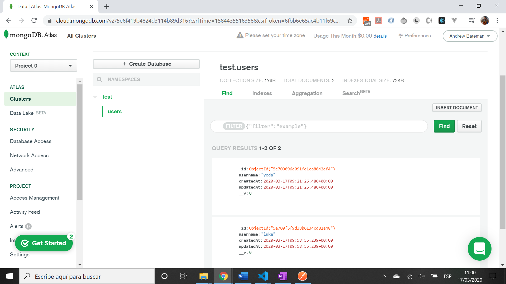
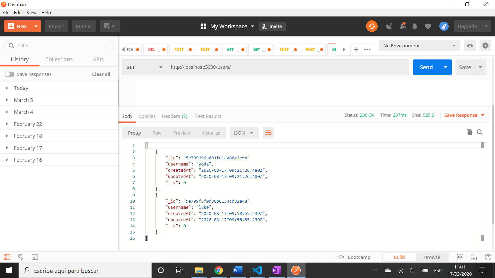
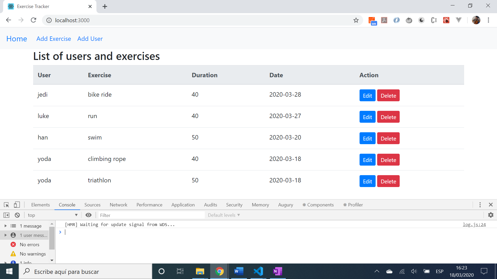
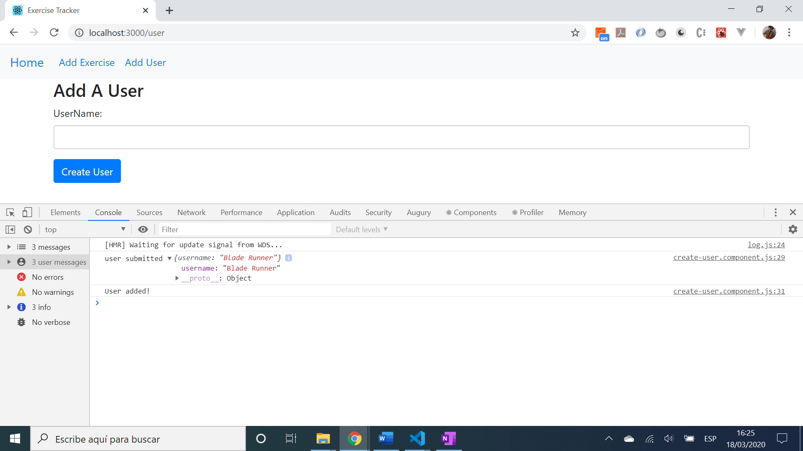
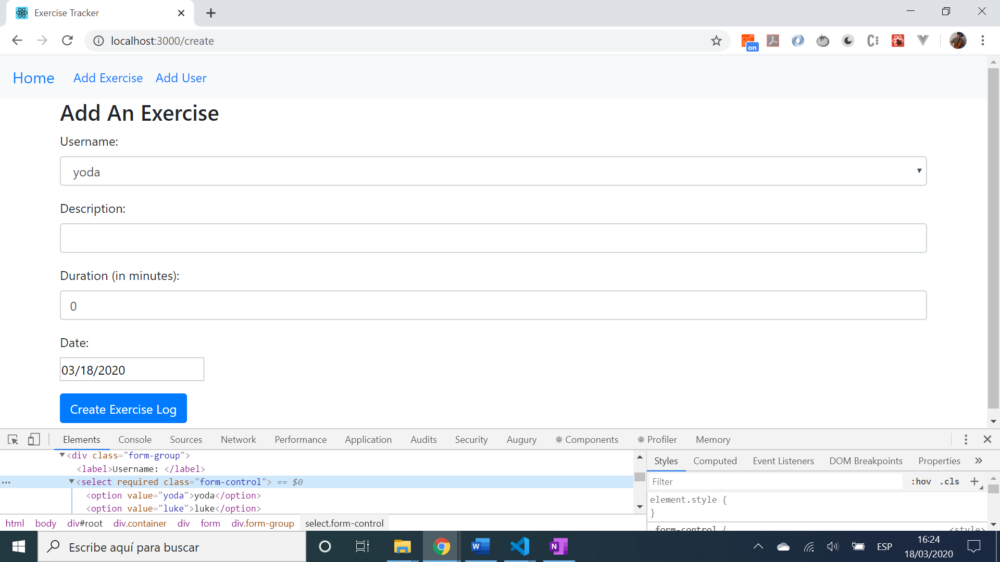

# :zap: MERN Full Stack Tracker

* Mongo Express React Node (MERN) full-stack app, integrates React frontend with Node.js backend.
* Tutorial code - see [:clap: Inspiration](#clap-inspiration) below but with customisations - particularly the mongoose connection script is more detailed and react frontend table has proper Bootstrap buttons to avoid error messages with edit & delete links.
* **Note:** to open web links in a new window use: _ctrl+click on link_


## :page_facing_up: Table of contents

* [:zap: MERN Full Stack Tracker](#zap-mern-full-stack-tracker)
  * [:page_facing_up: Table of contents](#page_facing_up-table-of-contents)
  * [:books: General info](#books-general-info)
    * [:books: Backend](#books-backend)
    * [:books: Frontend](#books-frontend)
  * [:camera: Screenshots](#camera-screenshots)
  * [:signal_strength: Backend Technologies](#signal_strength-backend-technologies)
  * [:signal_strength: Frontend Technologies](#signal_strength-frontend-technologies)
  * [:floppy_disk: Setup - Backend](#floppy_disk-setup---backend)
    * [:floppy_disk: Setup - Frontend](#floppy_disk-setup---frontend)
  * [:computer: Code Examples](#computer-code-examples)
  * [:cool: Backend Features](#cool-backend-features)
    * [:cool: Frontend Features](#cool-frontend-featurres)
  * [:clipboard: Status & To-Do List](#clipboard-status--to-do-list)
  * [:clap: Inspiration](#clap-inspiration)
  * [:envelope: Contact](#envelope-contact)

## :books: General info

### :books: Backend

* MongoDB Atlas used as the backend database - requires mongodb to be running (or use Mongoose and Heroku mLab to access)
* Mongoose models used to interact with the database
* Postman used to test the backend, although the tutorial uses [Insomnia, a similar REST API](https://insomnia.rest/)
* Note: I used 'my ip address' as the whitelist network access in MongoDB.Atlas but this required daily updating when my ip address changed - otherwise with a non-matching ip address the backend simply did not work. Better to use the localhost address to avoid this problem but may be less secure.
* Node.js routes used with controller functions
* 

### :books: Frontend

* React frontend includes a very simple Bootstrap navbar with just 3 links: home (the complete list of users/exercises), Add Exercise & Add User
* Main content is a React table with 5 columns - see screenshots for details

## :camera: Screenshots








## :signal_strength: Backend Technologies

* [MongoDB Community Server v4](https://www.mongodb.com/download-center/community)
* [Mongoose v5](https://mongoosejs.com/) object modelling for Node.js
* [npm mongodb v3](https://www.npmjs.com/package/mongodb) official MongoDB driver for Node.js
* [Express.js middleware v4](https://expressjs.com/)
* [Node.js v12](https://nodejs.org/es/)

## :signal_strength: Frontend Technologies

* [React framework v17](https://reactjs.org/)
* [Bootstrap v4](https://getbootstrap.com/) component library
* [React datepicker v3](https://www.npmjs.com/package/react-datepicker)
* [Axios v0.21.1](https://www.npmjs.com/package/axios) promise-based http client

## :floppy_disk: Setup - Backend

* Change to `/backend` directory
* Install dependencies using `npm i`
* Install [nodemon](https://www.npmjs.com/package/nodemon) globally if you don't already have it
* Register with [MongoDB Atlas](www.mongodb.com), create & configure a database cluster and add cluster connection string to .env file
* Run `nodemon server` for a dev server
* Navigate to `http://localhost:5000/`. The server will automatically reload if you change any of the source files

### :floppy_disk: Setup - Frontend

* From top-level directory `mern-stack-tracker` run `npm start`. Frontend will open at `http://localhost:3000/`

## :computer: Code Examples

* Extract from `server.js` - connects to database using mongoose

```javascript
const uri = process.env.ATLAS_URI;
const options = {
  useNewUrlParser: true,
  useCreateIndex: true,
  useUnifiedTopology: true
}

mongoose
  .connect(uri, options)
  .catch(error => console.log(error));

const connection = mongoose.connection;
connection.once('open', () => {
console.log("MongoDB database connection established successfully");
});
mongoose.connection.on('error', err => {
  logError('mongoose connection error', err);
});
```

* Extract from `exercise-list.js` - using lifecycle method `componentDidMount()` to get list of exercises from backend database using Axios http client, after component output has been rendered to the DOM

```javascript
  componentDidMount() {
    axios.get('http://localhost:5000/exercises/')
      .then(response => {
        this.setState({ exercises: response.data })
      })
      .catch((error) => {
        console.log(error);
      })
  }
```

## :cool: Backend Features

* All data stored in collections in a mongoDB Atlas database that costs nothing to use in the free tier option. Data can be edited from the mongoDB.Atlas collection or from within the React frontend

### :cool: Frontend Features

* Uses the [React componentDidMount() method](https://reactjs.org/docs/state-and-lifecycle.html)

## :clipboard: Status & To-Do List

* Status: Working full-stack app
* To-Do: Nothing

## :clap: Inspiration

* [The Best React JS by Beau Carnes: Learn the MERN Stack Full Tutorial MongoDB, Express, React, Node js](https://www.youtube.com/watch?v=FBeete8azkY)
* [React documentation](https://reactjs.org/docs/getting-started.html)

## :file_folder: License

* N/A.

## :envelope: Contact

* Repo created by [ABateman](https://github.com/AndrewJBateman), email: gomezbateman@yahoo.com
